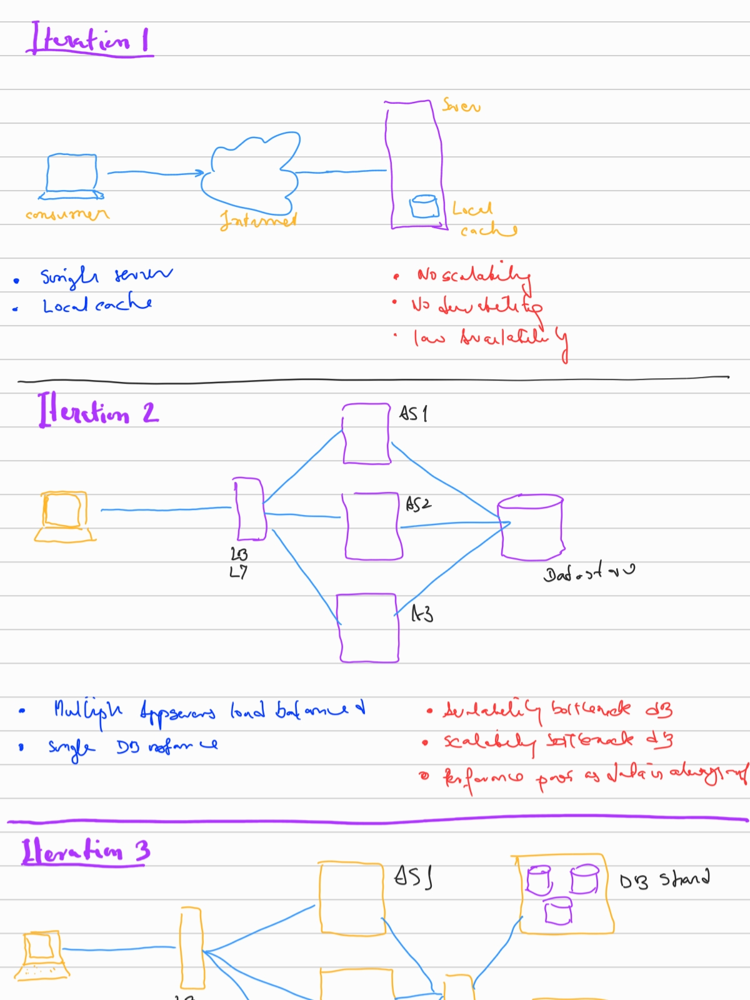
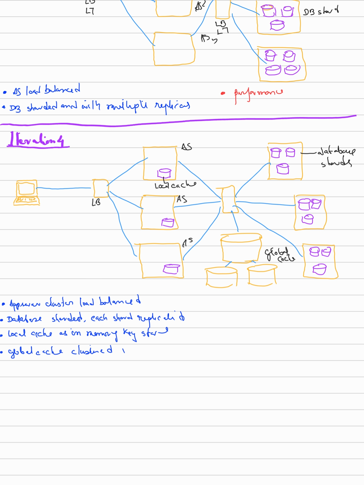

# Tiny URL
'
## Requirements Features
- create and return a short url given a big url
- Get the corresponding big url given a short url
- short url should be 6 chars long
- only a logged in user should be able to create a short url. Anyone can use a short url.
- Monitoring and Analytics

## Requirements Non Functional
- High Availability
- Scalability
- Min Read Latency
- Durability
- Eventual Consistency
- minimize cost

## Requirements Volume
30 million url reads / month
read / write ration of 100

## API Contract
- createShortURL(usertoken, bigURL, expiryTimestamp) -> bigURL
- getBigURL(shortURL) -> bigURL
- logon(credentials)
- logoff()

## DB Design
**url**
- shortUrl    -   8 bytes
- bigUrl  -   1 kb
- createTimestamp - 8 b
- expiryTimestamp - 8 b
- userId - 8 b

**profile**
- userid  8 b
- profile 1 kb

- space required - (2 kb * 3 m) = 6 GB / month
- bandwidth required - 2kb * 1 m / 24 * 60 * 60 = 25 kb / sec

## High Level Architecture

 

